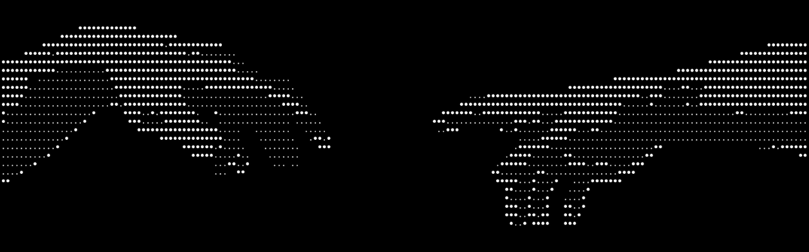

  
 <h1 align="center">Hi 👋, I'm Yassine</h1> 
<b>Networks &amp; Systems Engineering Student</b>
 
   

---

- 🔭 Currently building **Knoten**: A self hostable mesh VPN. Direct encrypted WireGuard tunnels between machines.

---

## 🛠️ Tech Stack

  
 
  

---

## 📊 GitHub Stats

   
 

  

---

## 📈 Activity Graph

  

---

 Always learning 

